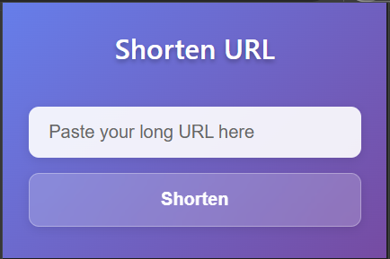
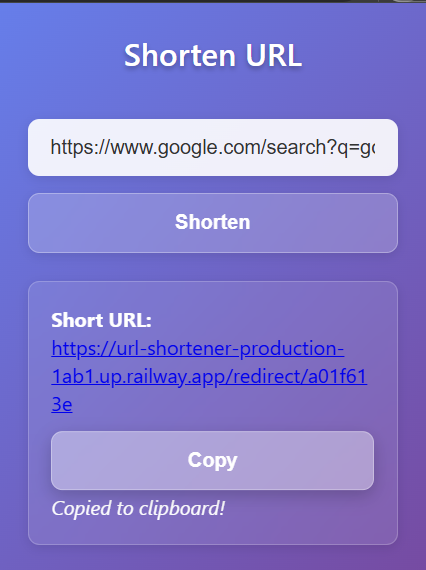

# URL Shortener with Real-Time Analytics

A full-stack URL shortener built in Go, featuring real-time analytics, MongoDB integration, and a Chrome Extension interface.


---

## 🌐 Live Backend

> [https://url-shortener-production-1ab1.up.railway.app](https://url-shortener-production-1ab1.up.railway.app)

---

## 📦 Features

- 🔗 Shorten long URLs using a clean hash-based method  
- 🌍 Real-time analytics (IP, browser, user agent)  
- 📦 Persistent storage using MongoDB  
- 🧩 Chrome Extension integration  
- 🛡️ CORS-safe for frontend access  
- 🧪 RESTful API with JSON support  

---

## 🏗️ Project Structure

```bash
url-shortener/
├── cmd/               # Entry point (main.go)
├── handler/           # HTTP handlers
├── service/           # Business logic
├── store/             # MongoDB operations
├── models/            # Data models
├── utils/             # Utility functions (hashing)
├── chrome-extension/  # Manifest, popup.html, popup.js
└── .env               # MongoDB URI
```
---
## ScreenShots



## 🚀 Getting Started
Prerequisites
Go 1.21+

MongoDB URI (use MongoDB Atlas or local MongoDB)

### 1. Clone Repo
```
git clone https://github.com/yourusername/url-shortener.git
cd url-shortener
```
### 2. Set Up .env
```
MONGO_URI=mongodb+srv://<user>:<password>@cluster.mongodb.net/?retryWrites=true
```
### 3. Run Locally
```
go run cmd/main.go
```
### 4. Test on Postman
```
POST /shorten — Pass JSON { "url": "https://example.com" }

GET /redirect/:id — Redirect to original

GET /analytics/:id — Get visit logs
```

## 🧩 Chrome Extension

**Setup**

- Open Chrome → chrome://extensions

- Enable Developer Mode

- Click Load Unpacked → select chrome-extension/ folder

**Usage** 

- Paste long URL

- Click Shorten → auto-copies the short URL
---
## 📊 Tech Stack
- Go (Golang)

- MongoDB

- Chrome Extension (Frontend)
